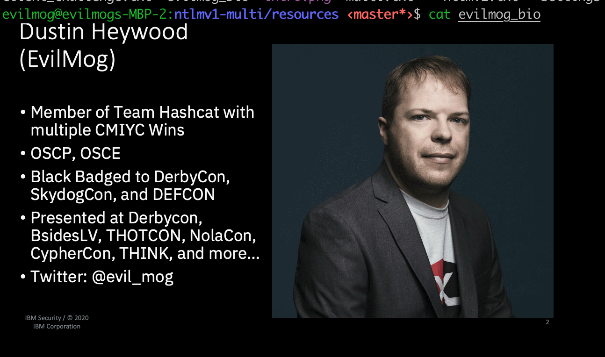

# show bio

`cat evilmog_bio`
    

# Print Spooler challenge/response
`cat ntlmv1.txt`
[ntlmv1.txt](ntlmv1.txt)

# LM Compatibility level registry setting
```
cat registry
cat settings
```

* [registry.png](registry.png) - registry settings
* [settings.png](settings.png) - vulnerabile settings
* [settings2.png](settings2.png) - more settings (less vulnerable, use level 5)

Fixed Settings in lm compat level 5

# NTLMv1 response
`cat v1_response.txt`
[v1_response.txt](v1_response.txt)

# LM Response
`cat lm_resp.txt`
[lm_resp.txt](lm_resp.txt)

# NT Response
`cat nt_resp.txt`
[nt_resp.txt](lm_resp.txt)

# client challenge
`cat client_challenge.txt`
[client_challenge.txt](client_challenge.txt)

# SSP
`cat ssp.txt`
[ssp.txt](ssp.txt)

# credits
`cat credits.txt`
[credits.txt](credits.txt)

# NTLMv1 Multi Tool
`cat multi.txt`
[multi](multi) - NTLMv1 Multi Tool

# remediation
set lm compatibility level to 5

# ad security checklist
`cat checklist.txt`
[checklist.txt](checklist.txt) - List of things you can do to harden active directory
